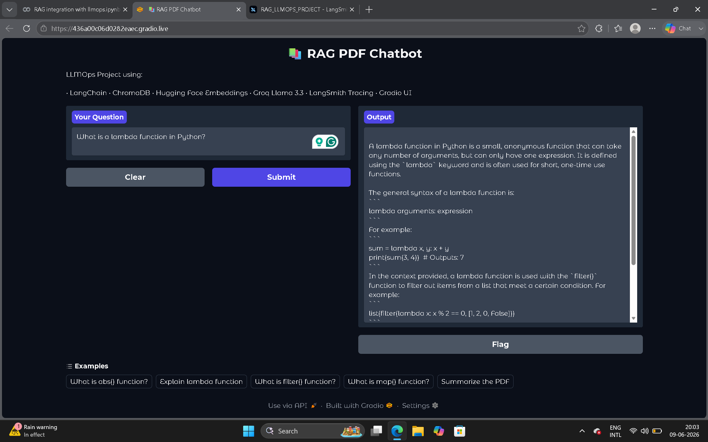
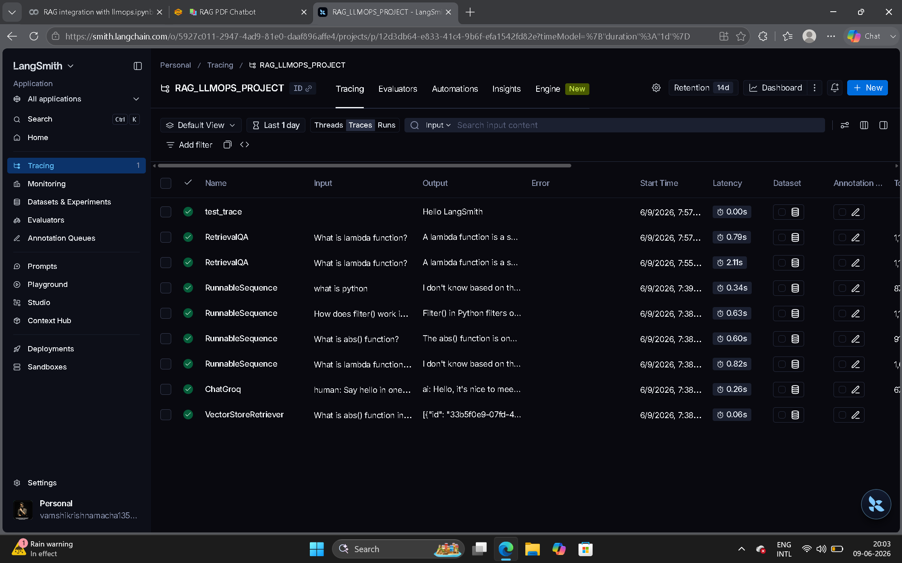
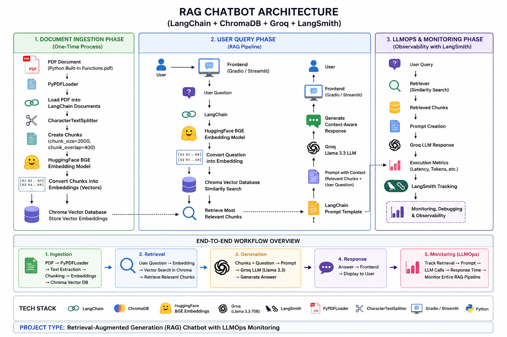
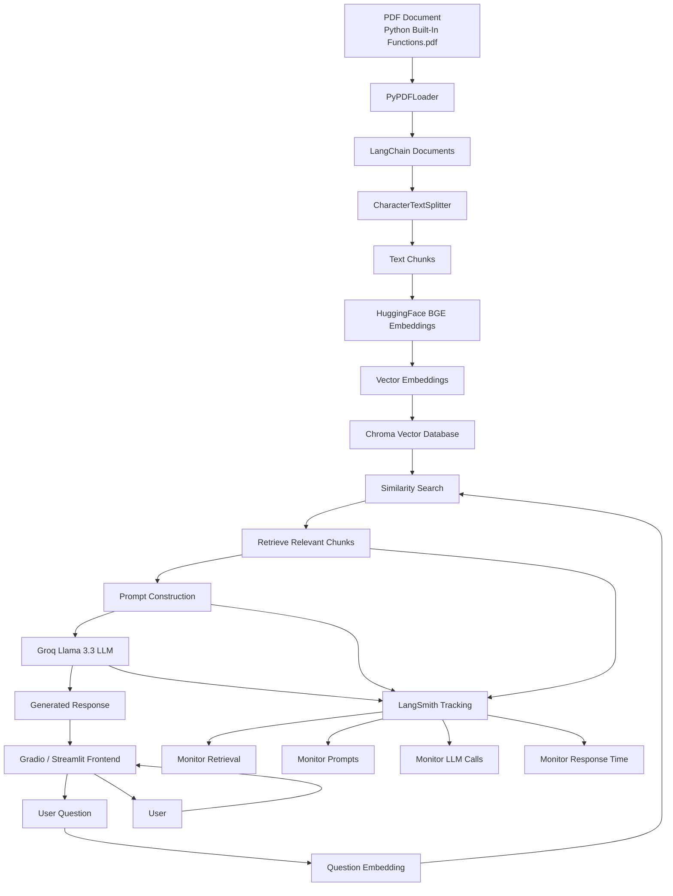

# rag-llmops-pdf-chatbot
RAG-based PDF Chatbot built using LangChain, ChromaDB, Hugging Face Embeddings, Groq Llama 3.3, LangSmith Tracing, and Gradio. The system performs document ingestion, chunking, vector embedding generation, similarity search, and contextual question answering over PDF documents while providing observability through LangSmith.

# RAG PDF Chatbot with LLMOps
## Gradio Chatbot Interface

## LangSmith Tracing

## Project Overview

This project implements a Retrieval-Augmented Generation (RAG) chatbot that answers questions from PDF documents using LangChain, ChromaDB, Hugging Face Embeddings, Groq Llama 3.3, LangSmith, and Gradio.

## Features

* PDF Document Loading
* Text Chunking
* Vector Embeddings
* ChromaDB Vector Database
* Similarity Search
* RetrievalQA
* Groq LLM Integration
* LangSmith Tracing
* Gradio Chatbot Interface

## Architecture

  

### Project Workflow

1. Load PDF using PyPDFLoader
2. Split document into chunks using CharacterTextSplitter
3. Generate embeddings using HuggingFace BGE
4. Store embeddings in Chroma Vector Database
5. User asks a question through Gradio/Streamlit
6. Question is converted into embeddings
7. Similarity search is performed in ChromaDB
8. Relevant chunks are retrieved
9. Context and question are sent to Groq Llama 3.3
10. LLM generates a contextual response
11. LangSmith tracks retrieval, prompts, LLM calls, latency, and responses

## Tech Stack

- LangChain
- ChromaDB
- HuggingFace BGE Embeddings
- Groq (Llama 3.3 70B)
- LangSmith
- PyPDFLoader
- CharacterTextSplitter
- Gradio / Streamlit
- Python

## Project Type

Retrieval-Augmented Generation (RAG) Chatbot with LLMOps Monitoring

## Author

Vamshi Krishna Macha

